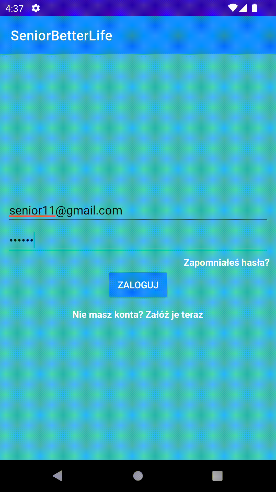

# SeniorBetterLife
-------------
An android app whose main goal is to help polish seniors/elderly people. Functionalities of application:
* Find Help(Znajdź pomoc) - this functionality is bridge between senior and volunteer.
Senior adds a task that is visible on the map for the volunteer.
* Active senior(Aktywny senior) - this functionality contains places with description whose are inteded for seniors.
* Pedometer(Licznik kroków) - simple pedometer with results in the form of charts
* Pill reminder(Leki) - reminds at specifed time about selected medicaments.

## Screenshots & Gifs:
### Senior panel - Main menu


### Senior panel - Profile


### Senior panel - Find Help(Znajdź pomoc)
&ensp;&ensp;

### Senior panel - Active Senior(Aktywny Senior)
&ensp;

### Senior panel - Pedometer(Licznik kroków)


### Senior panel - Pill reminder(Leki)
&ensp;&ensp;

### Volunteer panel & request for senior
&ensp;

## Installation
1. Download .zip 
or clone the source locally
```sh
$ git clone https://github.com/Daves9809/SeniorBetterLife
```
2. Connect app with Firebase, [documentation](https://firebase.google.com/docs/android/setup)
3. Add Google Maps Api Key to MAPS_API_KEY

## Library
* [Cloud Firestore](https://firebase.google.com/docs/firestore)
* [Firebase Authentification](https://firebase.google.com/docs/auth)
* [Cloud Storage](https://firebase.google.com/docs/storage)
* [Room Persistence Library](https://developer.android.com/topic/libraries/architecture/room)
* [Picasso](https://square.github.io/picasso/)
* [Coroutines](https://developer.android.com/kotlin/coroutines)
* [MPAndroidChart](https://github.com/PhilJay/MPAndroidChart)
* [Material Design](https://material.io/design)
* [Navigation](https://developer.android.com/guide/navigation)
* [RxJava2](https://github.com/ReactiveX/RxJava)

## API
* [Google Maps API](https://mapsplatform.google.com)

## App Architecture
* MVVM
* Kotlin
